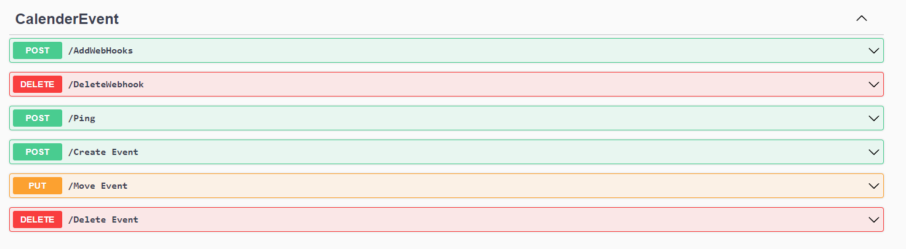

Du kan finde dokumentation for oprettelse af webhook ved brug af
"baseUrl/swagger/index.html" fra Web Hooks applikationen

De forskellige typer webhooks er som følge

```csharp
// Enum representing different types of events
public enum EventType
{
    None = 0,         // No specific event
    Ping = 1,         // Ping event
    AddEvent = 2,     // Add event
    RemoveEvent = 3,  // Remove event
    MoveEvent = 4     // Move event
}

Som følge er over overblik over de forskellige events til testning af webhooks


